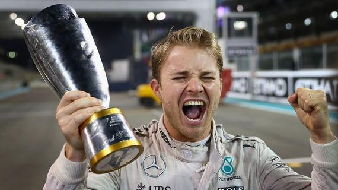

## To Be Continue

#### Nico Rosberg 2016

*this one is linked to the web*

**this one is local**

~~the news about his big victory~~

[罗斯伯格VS汉密尔顿：F1最旷日持久的宿敌之战 - Formula 1 新闻 - motorsport.com中文网](https://cn.motorsport.com/f1/news/罗斯伯格vs汉密尔顿-f1最旷日持久的宿敌之战-854432/854432/)

his record

| season | position |
| ------ | -------- |
| 2014   | 2nd      |
| 2015   | 2nd      |
| 2016   | 1st      |

## pot**ential** competitor

1. Charles Leclerc
2. Lando Norris
3. George Russell

 

<blockquote> maybe Zhou Guanyu 
    
</blockquote>

## other driver

* Daniel Ricciardo
* Pierre Gasly
* so on

 

~~~python
        if self.backbone_name == "vgg":
            for k in range(23):
                x = self.vgg[k](x)
        else:
            for k in range(14):
                x = self.mobilenet[k](x)
~~~

[go back](README.md)
